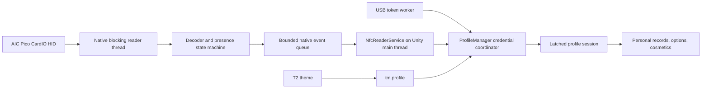

# Architecture

## Goal

Make a physical NFC card behave like an arcade login card while keeping the
existing USB-profile and Guest paths reliable. The physical credential chooses
a profile at Login; the resulting session identity remains latched even after
the card or USB is removed. Presence is retained separately for the arcade
"remove your card before leaving" prompt.

## Native side

`WindowsCardIoReader` enumerates HID interfaces and selects only the exact AIC
Pico CardIO endpoint. All device discovery and blocking reads remain on a
`std::jthread`. An overlapped read waits on both the device and a stop event, so
application shutdown does not have to wait for a card report.

The decoder converts a report into an 8-byte opaque card identity and a card
kind. The state machine emits one Present transition, ignores repeated reports
for the same held card, emits Removed on a zero report, and emits removal before
reader disconnection when required. The queue crosses into Unity through five
C exports.

## Unity side

`NfcReaderService` validates ABI version and struct size before consuming
events. It catches missing DLL, missing export, architecture, and native SEH
failures. It never performs the HID read itself and never logs a raw card ID.

`ProfileManager` is the session owner. It merges USB and NFC into namespaced
credential keys:

- `usb:token:<token>`
- `nfc:cardio:<16 uppercase hex characters>`
- `legacy:card:<old local card id>`

Profiles use a stable `profileId` and a list of credential aliases. One profile
can therefore be reached by both a USB token and an NFC card. A credential may
belong to only one local profile.

## Session rules

1. A card or USB is accepted only on Login, or while an authenticated player
   explicitly opens credential-link mode.
2. Authentication copies the resolved identity into session state.
3. Removing the physical credential never logs the player out and never changes
   record, option, score, or cosmetic routing.
4. Presence remains observable so the All Results / exit screen can ask the
   player to remove the credential.
5. A tap during gameplay is ignored unless explicit link mode is active.
6. A future server resolver can replace local folder scanning without changing
   the native ABI or theme contract.

## Failure containment

The native worker owns blocking I/O. Unity polls only a bounded queue. Missing
hardware is a feature-availability state, not a game failure. USB and Guest are
independent fallbacks. Raw credentials are deliberately kept out of Lua and out
of normal logs.

